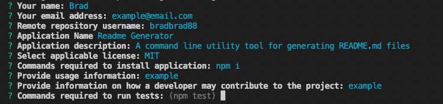

# readme-generator

[](https://opensource.org/licenses/MIT)


## Description

A command line utility tool for creating structured and consistent README.md files for Node libraries.

[Github Repository](https://github.com/bradbrad88/readme-generator)

[Demonstration video](https://drive.google.com/file/d/1mZ8RowwWMbHdIVMm4jkO7451-gK31Dgw/view?usp=sharing)



## Table of Contents

- [Installation](#installation)
- [Usage](#usage)
- [License](#license)
- [Contributing](#contributing)
- [Tests](#tests)
- [Questions](#questions)

## Installation

To install, run the following command:

```properties
npm i -g https://github.com/bradbrad88/readme-generator
```

## Usage

After installation, simply run the command

```properties
readme
```

in the terminal. A series of questions will prompt you for input to assist in creating the README.md file.

Options include the -y flag. Similar to

```properties
npm init -y
```

It will reduce the number of questions prompted and attempt to gather data automatically through the package.json file, git config variables and directory structure.

## License

Project license: [MIT](https://opensource.org/licenses/MIT). Copyright Brad Teague 2022.

## Contributing

If you have a feature request, please make a pull request [here](https://github.com/bradbrad88/readme-generator) or add it as an issue [here](https://github.com/bradbrad88/readme-generator/issues).

If you have a bug to report, please create an issue [here](https://github.com/bradbrad88/readme-generator/issues).

## Questions

For any questions about the project, please raise an issue at [this issues page](https://github.com/bradbrad88/readme-generator/issues).

You may also contact me directly [here](b_rad88@live.com).
